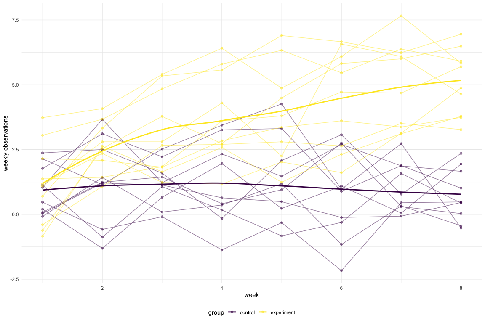

p8105\_hw5\_solutions
================
Shuhong Xiang
2020-11-18

## Problem 1

### Load the data.

``` r
homcide_df =
  read_csv("homcide_data/homicide-data.csv") %>%
  mutate(
    city_state = str_c(city, state, sep = "_"), 
    resolved = case_when(
      disposition == "Closed without arrest" ~ "unsolved",
      disposition == "Open/No arrest"        ~ "unsolved",
      disposition == "Closed by arrest"      ~ "solved",
    )
  ) %>%
  select(city_state, resolved) %>%
  filter(city_state != "Tulsa_AL")
```

    ## Parsed with column specification:
    ## cols(
    ##   uid = col_character(),
    ##   reported_date = col_double(),
    ##   victim_last = col_character(),
    ##   victim_first = col_character(),
    ##   victim_race = col_character(),
    ##   victim_age = col_character(),
    ##   victim_sex = col_character(),
    ##   city = col_character(),
    ##   state = col_character(),
    ##   lat = col_double(),
    ##   lon = col_double(),
    ##   disposition = col_character()
    ## )

``` r
aggregate_df = 
  homcide_df %>%
  group_by(city_state) %>%
  summarise(
    hom_total = n(),
    hom_unsolved = sum(resolved == "unsolved")
  )
```

    ## `summarise()` ungrouping output (override with `.groups` argument)

### Prop test for a single city:

``` r
prop.test(
  aggregate_df%>%filter(city_state == "Baltimore_MD") %>% pull(hom_unsolved), 
  aggregate_df%>%filter(city_state == "Baltimore_MD") %>% pull(hom_total)) %>%
  broom::tidy()
```

    ## # A tibble: 1 x 8
    ##   estimate statistic  p.value parameter conf.low conf.high method    alternative
    ##      <dbl>     <dbl>    <dbl>     <int>    <dbl>     <dbl> <chr>     <chr>      
    ## 1    0.646      239. 6.46e-54         1    0.628     0.663 1-sample… two.sided

### Try to iterate:

``` r
results_df = 
  aggregate_df %>%
  mutate(
    prop_tests = map2(.x = hom_unsolved, .y = hom_total, ~prop.test(x = .x, n = .y)),
    tidy_tests = map(.x = prop_tests, ~broom::tidy(.x))
  ) %>%
  select(-prop_tests) %>%
  unnest(tidy_tests) %>%
  select(city_state, estimate, conf.low, conf.high)
```

``` r
results_df %>%
  mutate(city_state = fct_reorder(city_state, estimate)) %>% 
  ggplot(aes(x = city_state, y = estimate))+
  geom_point() + 
  geom_errorbar(aes(ymin = conf.low, ymax = conf.high)) +
  theme(axis.text = element_text(angle = 90, vjust = 0.5, hjust = 1))
```


## Problem 2

### Create path\_df containing all data from the csv:

``` r
path_df =
  tibble(
  path = list.files("lda_data"),
) %>%
  mutate(path = str_c("lda_data/", path),
         data = map(path, read_csv)
           )%>%
  unnest(data)
```

    ## Parsed with column specification:
    ## cols(
    ##   week_1 = col_double(),
    ##   week_2 = col_double(),
    ##   week_3 = col_double(),
    ##   week_4 = col_double(),
    ##   week_5 = col_double(),
    ##   week_6 = col_double(),
    ##   week_7 = col_double(),
    ##   week_8 = col_double()
    ## )
    ## Parsed with column specification:
    ## cols(
    ##   week_1 = col_double(),
    ##   week_2 = col_double(),
    ##   week_3 = col_double(),
    ##   week_4 = col_double(),
    ##   week_5 = col_double(),
    ##   week_6 = col_double(),
    ##   week_7 = col_double(),
    ##   week_8 = col_double()
    ## )
    ## Parsed with column specification:
    ## cols(
    ##   week_1 = col_double(),
    ##   week_2 = col_double(),
    ##   week_3 = col_double(),
    ##   week_4 = col_double(),
    ##   week_5 = col_double(),
    ##   week_6 = col_double(),
    ##   week_7 = col_double(),
    ##   week_8 = col_double()
    ## )
    ## Parsed with column specification:
    ## cols(
    ##   week_1 = col_double(),
    ##   week_2 = col_double(),
    ##   week_3 = col_double(),
    ##   week_4 = col_double(),
    ##   week_5 = col_double(),
    ##   week_6 = col_double(),
    ##   week_7 = col_double(),
    ##   week_8 = col_double()
    ## )
    ## Parsed with column specification:
    ## cols(
    ##   week_1 = col_double(),
    ##   week_2 = col_double(),
    ##   week_3 = col_double(),
    ##   week_4 = col_double(),
    ##   week_5 = col_double(),
    ##   week_6 = col_double(),
    ##   week_7 = col_double(),
    ##   week_8 = col_double()
    ## )
    ## Parsed with column specification:
    ## cols(
    ##   week_1 = col_double(),
    ##   week_2 = col_double(),
    ##   week_3 = col_double(),
    ##   week_4 = col_double(),
    ##   week_5 = col_double(),
    ##   week_6 = col_double(),
    ##   week_7 = col_double(),
    ##   week_8 = col_double()
    ## )
    ## Parsed with column specification:
    ## cols(
    ##   week_1 = col_double(),
    ##   week_2 = col_double(),
    ##   week_3 = col_double(),
    ##   week_4 = col_double(),
    ##   week_5 = col_double(),
    ##   week_6 = col_double(),
    ##   week_7 = col_double(),
    ##   week_8 = col_double()
    ## )
    ## Parsed with column specification:
    ## cols(
    ##   week_1 = col_double(),
    ##   week_2 = col_double(),
    ##   week_3 = col_double(),
    ##   week_4 = col_double(),
    ##   week_5 = col_double(),
    ##   week_6 = col_double(),
    ##   week_7 = col_double(),
    ##   week_8 = col_double()
    ## )
    ## Parsed with column specification:
    ## cols(
    ##   week_1 = col_double(),
    ##   week_2 = col_double(),
    ##   week_3 = col_double(),
    ##   week_4 = col_double(),
    ##   week_5 = col_double(),
    ##   week_6 = col_double(),
    ##   week_7 = col_double(),
    ##   week_8 = col_double()
    ## )
    ## Parsed with column specification:
    ## cols(
    ##   week_1 = col_double(),
    ##   week_2 = col_double(),
    ##   week_3 = col_double(),
    ##   week_4 = col_double(),
    ##   week_5 = col_double(),
    ##   week_6 = col_double(),
    ##   week_7 = col_double(),
    ##   week_8 = col_double()
    ## )
    ## Parsed with column specification:
    ## cols(
    ##   week_1 = col_double(),
    ##   week_2 = col_double(),
    ##   week_3 = col_double(),
    ##   week_4 = col_double(),
    ##   week_5 = col_double(),
    ##   week_6 = col_double(),
    ##   week_7 = col_double(),
    ##   week_8 = col_double()
    ## )
    ## Parsed with column specification:
    ## cols(
    ##   week_1 = col_double(),
    ##   week_2 = col_double(),
    ##   week_3 = col_double(),
    ##   week_4 = col_double(),
    ##   week_5 = col_double(),
    ##   week_6 = col_double(),
    ##   week_7 = col_double(),
    ##   week_8 = col_double()
    ## )
    ## Parsed with column specification:
    ## cols(
    ##   week_1 = col_double(),
    ##   week_2 = col_double(),
    ##   week_3 = col_double(),
    ##   week_4 = col_double(),
    ##   week_5 = col_double(),
    ##   week_6 = col_double(),
    ##   week_7 = col_double(),
    ##   week_8 = col_double()
    ## )
    ## Parsed with column specification:
    ## cols(
    ##   week_1 = col_double(),
    ##   week_2 = col_double(),
    ##   week_3 = col_double(),
    ##   week_4 = col_double(),
    ##   week_5 = col_double(),
    ##   week_6 = col_double(),
    ##   week_7 = col_double(),
    ##   week_8 = col_double()
    ## )
    ## Parsed with column specification:
    ## cols(
    ##   week_1 = col_double(),
    ##   week_2 = col_double(),
    ##   week_3 = col_double(),
    ##   week_4 = col_double(),
    ##   week_5 = col_double(),
    ##   week_6 = col_double(),
    ##   week_7 = col_double(),
    ##   week_8 = col_double()
    ## )
    ## Parsed with column specification:
    ## cols(
    ##   week_1 = col_double(),
    ##   week_2 = col_double(),
    ##   week_3 = col_double(),
    ##   week_4 = col_double(),
    ##   week_5 = col_double(),
    ##   week_6 = col_double(),
    ##   week_7 = col_double(),
    ##   week_8 = col_double()
    ## )
    ## Parsed with column specification:
    ## cols(
    ##   week_1 = col_double(),
    ##   week_2 = col_double(),
    ##   week_3 = col_double(),
    ##   week_4 = col_double(),
    ##   week_5 = col_double(),
    ##   week_6 = col_double(),
    ##   week_7 = col_double(),
    ##   week_8 = col_double()
    ## )
    ## Parsed with column specification:
    ## cols(
    ##   week_1 = col_double(),
    ##   week_2 = col_double(),
    ##   week_3 = col_double(),
    ##   week_4 = col_double(),
    ##   week_5 = col_double(),
    ##   week_6 = col_double(),
    ##   week_7 = col_double(),
    ##   week_8 = col_double()
    ## )
    ## Parsed with column specification:
    ## cols(
    ##   week_1 = col_double(),
    ##   week_2 = col_double(),
    ##   week_3 = col_double(),
    ##   week_4 = col_double(),
    ##   week_5 = col_double(),
    ##   week_6 = col_double(),
    ##   week_7 = col_double(),
    ##   week_8 = col_double()
    ## )
    ## Parsed with column specification:
    ## cols(
    ##   week_1 = col_double(),
    ##   week_2 = col_double(),
    ##   week_3 = col_double(),
    ##   week_4 = col_double(),
    ##   week_5 = col_double(),
    ##   week_6 = col_double(),
    ##   week_7 = col_double(),
    ##   week_8 = col_double()
    ## )

``` r
path_df
```

    ## # A tibble: 20 x 9
    ##    path                week_1 week_2 week_3 week_4 week_5 week_6 week_7 week_8
    ##    <chr>                <dbl>  <dbl>  <dbl>  <dbl>  <dbl>  <dbl>  <dbl>  <dbl>
    ##  1 lda_data/con_01.csv   0.2  -1.31    0.66   1.96   0.23   1.09   0.05   1.94
    ##  2 lda_data/con_02.csv   1.13 -0.88    1.07   0.17  -0.83  -0.31   1.58   0.44
    ##  3 lda_data/con_03.csv   1.77  3.11    2.22   3.26   3.31   0.89   1.88   1.01
    ##  4 lda_data/con_04.csv   1.04  3.66    1.22   2.33   1.47   2.7    1.87   1.66
    ##  5 lda_data/con_05.csv   0.47 -0.580  -0.09  -1.37  -0.32  -2.17   0.45   0.48
    ##  6 lda_data/con_06.csv   2.37  2.5     1.59  -0.16   2.08   3.07   0.78   2.35
    ##  7 lda_data/con_07.csv   0.03  1.21    1.13   0.64   0.49  -0.12  -0.07   0.46
    ##  8 lda_data/con_08.csv  -0.08  1.42    0.09   0.36   1.18  -1.16   0.33  -0.44
    ##  9 lda_data/con_09.csv   0.08  1.24    1.44   0.41   0.95   2.75   0.3    0.03
    ## 10 lda_data/con_10.csv   2.14  1.15    2.52   3.44   4.26   0.97   2.73  -0.53
    ## 11 lda_data/exp_01.csv   3.05  3.67    4.84   5.8    6.33   5.46   6.38   5.91
    ## 12 lda_data/exp_02.csv  -0.84  2.63    1.64   2.58   1.24   2.32   3.11   3.78
    ## 13 lda_data/exp_03.csv   2.15  2.08    1.82   2.84   3.36   3.61   3.37   3.74
    ## 14 lda_data/exp_04.csv  -0.62  2.54    3.78   2.73   4.49   5.82   6      6.49
    ## 15 lda_data/exp_05.csv   0.7   3.33    5.34   5.57   6.9    6.66   6.24   6.95
    ## 16 lda_data/exp_06.csv   3.73  4.08    5.4    6.41   4.87   6.09   7.66   5.83
    ## 17 lda_data/exp_07.csv   1.18  2.35    1.23   1.17   2.02   1.61   3.13   4.88
    ## 18 lda_data/exp_08.csv   1.37  1.43    1.84   3.6    3.8    4.72   4.68   5.7 
    ## 19 lda_data/exp_09.csv  -0.4   1.08    2.66   2.7    2.8    2.64   3.51   3.27
    ## 20 lda_data/exp_10.csv   1.09  2.8     2.8    4.3    2.25   6.57   6.09   4.64

### Clean the datafram:

``` r
tidy_lda =
  path_df %>%
  mutate(
    path = str_remove_all(path,"lda_data/"), 
    path = str_remove_all(path,".csv")
  ) %>%
  separate(path, into = c("group","subject_id"), sep = 3) %>%
  mutate(
    subject_id = str_remove_all(subject_id, "_"),
    group = str_replace(group,"con","control"),
    group = str_replace(group,"exp","experiment")
  )%>%
  pivot_longer(
    week_1:week_8,
    names_prefix = "week_",
    names_to = "week",
    values_to = "weekly observations"
  )%>%
  mutate(week = as.numeric(week))
tidy_lda
```

    ## # A tibble: 160 x 4
    ##    group   subject_id  week `weekly observations`
    ##    <chr>   <chr>      <dbl>                 <dbl>
    ##  1 control 01             1                  0.2 
    ##  2 control 01             2                 -1.31
    ##  3 control 01             3                  0.66
    ##  4 control 01             4                  1.96
    ##  5 control 01             5                  0.23
    ##  6 control 01             6                  1.09
    ##  7 control 01             7                  0.05
    ##  8 control 01             8                  1.94
    ##  9 control 02             1                  1.13
    ## 10 control 02             2                 -0.88
    ## # … with 150 more rows

### Make a spaghetti plot showing observations on each subject over time, and comment on differences between groups:

``` r
plot_p2 =
  tidy_lda %>%
  unite("id", c(group, subject_id), sep = "_", remove = F) %>%
  ggplot(aes(x = week,
             y = `weekly observations`)) +
  geom_point(aes(color = group,
                group = id),
             alpha = .5)+
  geom_path(aes(color = group,
                group = as.factor(id)),
            alpha = 0.5) +
  geom_smooth(aes(color = group), method = loess, se = F)

ggsave("plot_p2.png", path = "Figs")
```

    ## Saving 8 x 6 in image

    ## `geom_smooth()` using formula 'y ~ x'

``` r
plot_p2
```

    ## `geom_smooth()` using formula 'y ~ x'



From the graph above, we can see that the control groups and experiment
groups began the study at the same level of weekly observations. As the
study goes on, the control group remain steadily around the same level
as beginning whereas the experiment groups increase gradually.

## Problem 3

Conduct a simulation to explore power in a one-sample t-test.

### First set n =30 and sigma =5 for the whole problem. Then, set μ=0. Generate 5000 datasets from the model \[x ~ Normal[mu, sigma]\] :

``` r
mu_0 <- 0
n_sim <- 5000

set.seed(5000)

 t_test_mu_0 = function(n = 30, mu, sigma = 5) {
  
  t_test_df = tibble(
    
    x = rnorm(n =30, mean = mu, sd = sigma)
  )
  
  t_test_df %>%
    summarise(
      mu_estimated = mean(x),
      p_val = t.test(x, conf.level = 0.95) %>% broom::tidy() %>% pull(p.value),
      mu = mu
    )
}

results_mu_0 = vector("list", n_sim)

for(i in 1 : n_sim){
  
  results_mu_0[[i]] = t_test_mu_0(mu = mu_0)
  
}

sim_mu_0 = bind_rows(results_mu_0)
sim_mu_0
```

    ## # A tibble: 5,000 x 3
    ##    mu_estimated  p_val    mu
    ##           <dbl>  <dbl> <dbl>
    ##  1       -0.357 0.655      0
    ##  2        1.03  0.189      0
    ##  3       -0.965 0.462      0
    ##  4       -0.704 0.370      0
    ##  5        1.27  0.185      0
    ##  6        1.62  0.0655     0
    ##  7       -2.09  0.0638     0
    ##  8        0.341 0.785      0
    ##  9       -1.32  0.0895     0
    ## 10        0.128 0.859      0
    ## # … with 4,990 more rows

### Repeat the above for μ={1,2,3,4,5,6}:

``` r
set.seed(5000)

sim_t_test = function(n = 30, mu, sigma = 5) {
  
  results_6_mu = vector("list", n_sim)
  
  for(i in 1:n_sim){
    
    results_6_mu[[i]] = t_test_mu_0(mu = mu)
    
  }
  results_sim_t_test = bind_rows(results_6_mu)
}

sim_6_mu = vector("list", 6)

for(i in 1:6){
  
  sim_6_mu[[i]] = sim_t_test(mu = i)
  
}

  results_all = bind_rows(sim_6_mu)

  results_all
```

    ## # A tibble: 30,000 x 3
    ##    mu_estimated   p_val    mu
    ##           <dbl>   <dbl> <int>
    ##  1       0.643  0.422       1
    ##  2       2.03   0.0131      1
    ##  3       0.0351 0.979       1
    ##  4       0.296  0.705       1
    ##  5       2.27   0.0217      1
    ##  6       2.62   0.00432     1
    ##  7      -1.09   0.323       1
    ##  8       1.34   0.288       1
    ##  9      -0.325  0.670       1
    ## 10       1.13   0.124       1
    ## # … with 29,990 more rows

For the plot, we combine the mu = 0 to make a complete dataset:

``` r
sim_all = bind_rows(results_all, sim_mu_0)
sim_all
```

    ## # A tibble: 35,000 x 3
    ##    mu_estimated   p_val    mu
    ##           <dbl>   <dbl> <dbl>
    ##  1       0.643  0.422       1
    ##  2       2.03   0.0131      1
    ##  3       0.0351 0.979       1
    ##  4       0.296  0.705       1
    ##  5       2.27   0.0217      1
    ##  6       2.62   0.00432     1
    ##  7      -1.09   0.323       1
    ##  8       1.34   0.288       1
    ##  9      -0.325  0.670       1
    ## 10       1.13   0.124       1
    ## # … with 34,990 more rows

### Make a plot showing the proportion of times the null was rejected (the power of the test) on the y axis and the true value of μ on the x axis. Describe the association between effect size and power.

``` r
plot_power_test =
sim_all  %>%
  filter(p_val < 0.5) %>%
  mutate(mu = as_factor(mu)) %>%
  count(mu) %>%
ggplot(aes(x = mu, y = n/5000, fill = mu))+
  geom_bar(stat = "identity")+
  labs(
    x = "True Mean(mu)",
    y = "The Proportion of Times the Null was Rejected",
    title = "The Power of the Test"
  )

ggsave("The Power of the Test.png", path = "Figs")
```

    ## Saving 8 x 6 in image

``` r
plot_power_test
```

 From the bar char
above, we can see the power of test increase with the the true value of
mu.The proportion of rejecting null reach 1 when mu greater than 3. The
effect size is also

### Make a plot showing the average estimate of μ̂ on the y axis and the true value of μ on the x axis. Make a second plot (or overlay on the first) the average estimate of μ̂ only in samples for which the null was rejected on the y axis and the true value of μ on the x axis.

``` r
estimated_mu_data = sim_all%>%
  mutate(mu = as.numeric(mu)) %>%
  group_by(mu)%>%
  summarise(mean_estimated_mu = mean(mu_estimated)) %>%
  mutate(group = "Total")

reject_null_data = sim_all%>%
 mutate(mu = as.numeric(mu)) %>%
  filter(p_val < 0.5)%>%
  group_by(mu)%>%
  summarise(mean_estimated_mu = mean(mu_estimated)) %>%
  mutate(group = "Reject Null")

plot_p3_data = combine(estimated_mu_data, reject_null_data)

plot_average_vs_mu = 
ggplot(plot_p3_data, aes(x = mu, y = mean_estimated_mu), group = group, color = group)+
    geom_point()+
  geom_smooth(aes(color = group))+
  labs(
    x = "True Mean(mu)",
    y = "The Average Estimate",
    title = "The Average Estimate vs True mu"
  )
  
ggsave("Average Estimate vs True mu.png", path = "Figs")
plot_average_vs_mu
```


#### Is the sample average of μ̂ across tests for which the null is rejected approximately equal to the true value of μ? Why or why not?

Yes. From the graph above, we cannot see any obvious outliners. Also,
the two trend lines are close to each other. Therefore, the sample
average of μ̂ across test is consistent with the true μ.
